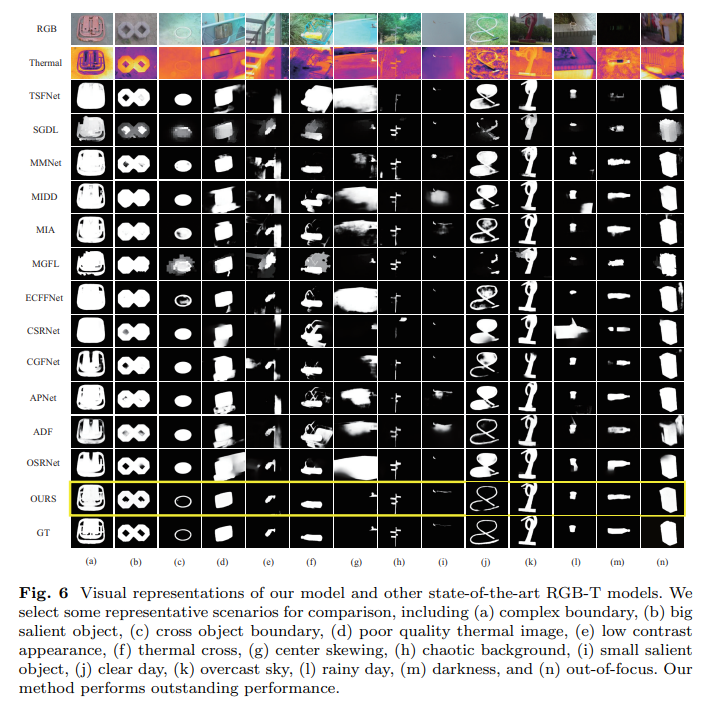
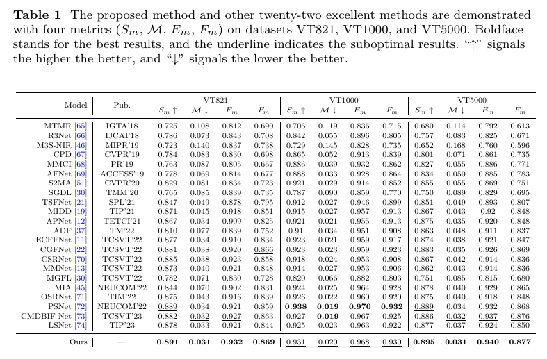

# RGB-T Salient Object Detection via Excavating and Enhancing CNN Features
  
   Figure.1 The overall architecture of the proposed E2Net model, which is published in Applied Intlligence 🎆.  
   
# 1.Requirements
Python v3.6, Pytorch 0.4.0+, Cuda 10.0, TensorboardX 2.0, opencv-python

# 2.Data Preparation
Download the train data from [here](https://pan.baidu.com/s/1HQMjdqY1C6m9_joybUv2Dw)[code:NEPU], test data from [here](https://pan.baidu.com/s/1xIvwBd8LjmJRwkIMQWqaVQ)[code:NEPU], test_in_train data from [here](https://pan.baidu.com/s/1HChMhmnZh3YCLQpxutLvLg)[code:NEPU]. Then put them under the following directory:  

    -Dataset\   
       -train\  
       -test\ 
           -VT821\
           -VT1000\
           -VT5000_test\
       -test_in_train\

# 3.Training/Testing & Evaluating
* **Training the E2Net**  

Please download the released code and the data set, then:  
  
    run python train.py  
    
* **Testing the E2Net**  

Please download the trained weights from [here](https://pan.baidu.com/s/1t-moj9tw_NEsvrXbr8hjug)[code:NEPU], and put it in './pre' folder, then:  

    run python test.py  

Then the test maps will be saved to './Salmaps/'

* **Evaluate the result maps**  

You can evaluate the result maps using the tool from [here](https://pan.baidu.com/s/1gmckcn7FZuDP2ufiTM6qow)[code:NEPU], thanks for [Dengpin Fan](https://github.com/DengPingFan).

# 4.Results
* **Qualitative comparison**  

  
Figure.2 Qualitative comparison of our proposed method with some SOTA methods.  

* **Quantitative comparison** 

  
Table.1 Quantitative comparison with some SOTA models on three public RGB-T benchmark datasets. 

* **Salmaps**   
The salmaps of the above datasets can be download from [here](https://pan.baidu.com/s/1koPepoAmB1AV-LHxfEI0vg) [code:NEPU]

# 5.Contact  
If you have any questions, feel free to contact us via wuranwan2020@sina.com (Ranwan Wu). 
For more related work, you can also visit [wuranwan](https://github.com/RanwanWu).

